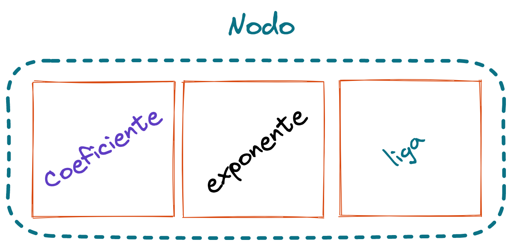
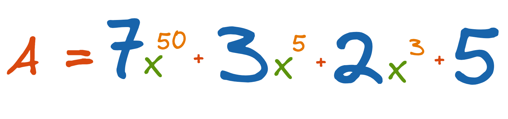
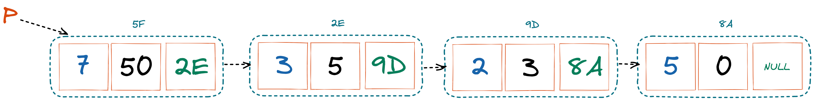

# Polinomios representados como Listas Ligadas

Se utiliza un **nodo** para guardar el **coeficiente** y el **exponente** de cada uno de los términos del Polinomio.

Cada uno de los nodos se van agregando a la **lista** de manera decreciente de acuerdo al termino.

## Configuración del Nodo

Si tenemos el siguiente polinomio de **grado 50**.

La siguiente figura muestra la representación del polinomio en una lista ligada.

## Métodos Principales Polinomio Lista Ligada

1. [Clase Nodo]()
2. [Insertar Término]()
3. [Sumar]()
4. [Multiplicar]()
