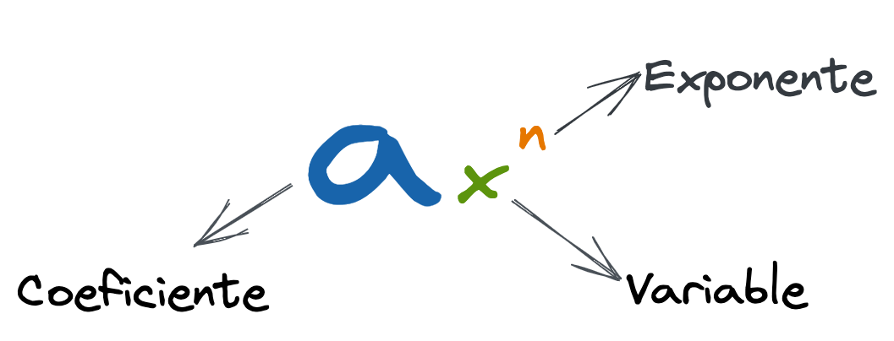
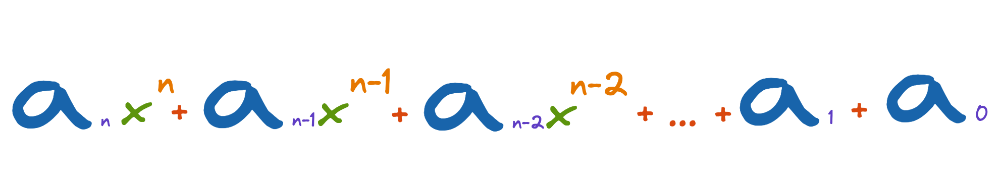
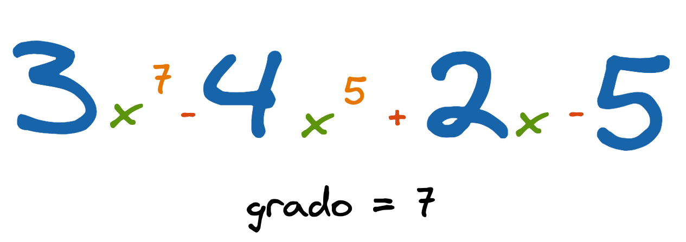

# Polinomios

Un Polinomio es un objeto matemático utilizado en cálculo y análisis matemático para apróximar cualquier función derivable.

Un polinomio es una expresión compuesta por dos o más términos algebraicos unidos con los signos `+` y `-`.

## Forma general de un polinomio

## Ejemplo

